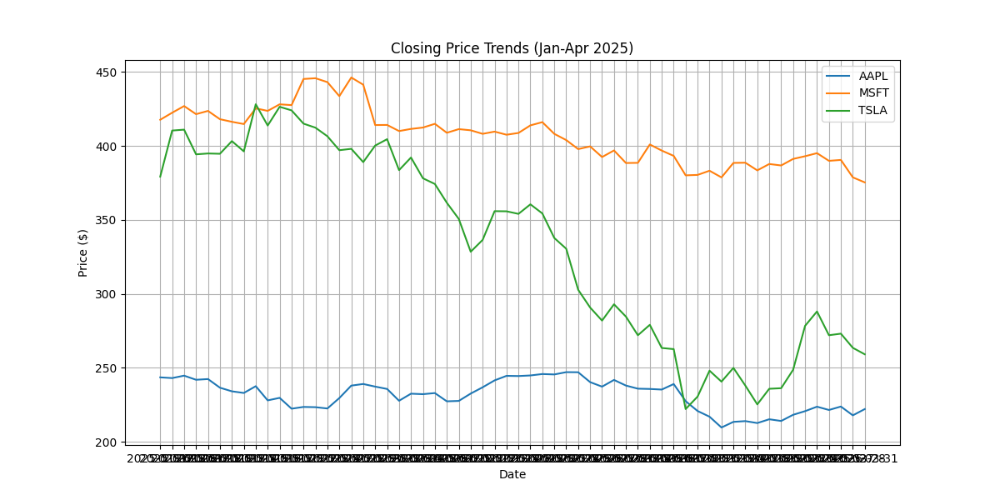
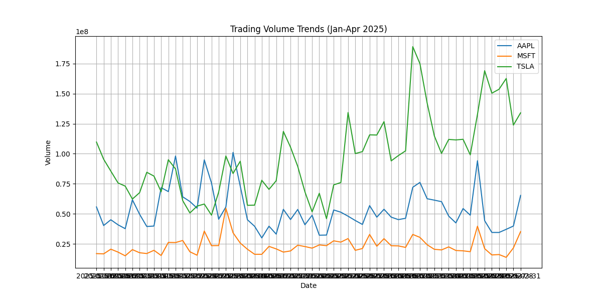

# Financial Research Report

## Summary
This report summarizes the financial research conducted on technology and finance topics, focusing on AI, AI Agents, Automation, and Fintech. The analysis covers asset classes (commodities, forex, crypto, equities) and specific tickers (AAPL, MSFT, TSLA).

## Key Findings

### 1. News Sentiment Analysis
- **Tesla (TSLA)**: Negative sentiment due to challenges in AI growth and new tariffs. JPMorgan cut its EPS forecast.
- **Microsoft (MSFT)**: Negative sentiment on January 30, 2025, due to disappointing revenue outlook, leading to a 6.2% stock drop.

### 2. Market Trends
- **Price Trends**: Visualized in 'price_trends.png'.
- **Volume Trends**: Visualized in 'volume_trends.png'.

### 3. Anomalies Detected
- **MSFT**: Volume anomaly on January 30, 2025, linked to weak revenue guidance.

## Recommendations
- Monitor news events for Tesla and Microsoft, as they significantly impact stock performance.
- Watch for volume spikes as indicators of market reactions to news.

## Visualizations
- Price Trends: 
- Volume Trends: 
